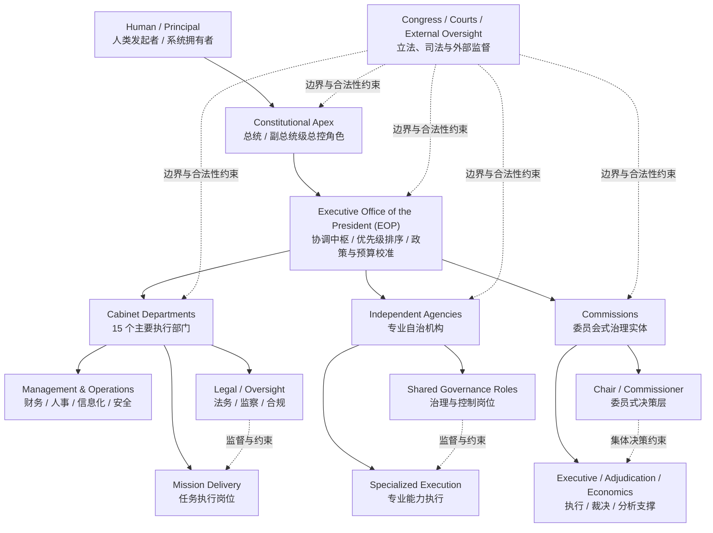

# US Federal SOUL

> 参考 [cft0808/edict](https://github.com/cft0808/edict) 的 README 组织方式，但不复刻它的制度隐喻。  
> `edict` 以“三省六部制”重构 AI 多 agent 协作；本项目则以**美国现代联邦行政组织架构**为基础，构建一套更适合现代复杂组织、权责边界、跨部门协同与审查链路的 **AI 多 agent 协作架构**。

<p align="center">
  <b>342 份岗位 SOUL</b> ·
  <b>35 个实体</b> ·
  <b>Constitutional Apex / EOP / Departments / Independent Agencies / Commissions</b>
</p>

<p align="center">
  <a href="./docs/README.md">文档入口</a> ·
  <a href="./docs/us-federal-soul-docs-architecture.md">架构图</a> ·
  <a href="./docs/us-federal-soul-index.md">索引</a> ·
  <a href="./docs/us-federal-soul-coverage-matrix.md">覆盖矩阵</a> ·
  <a href="./agents/">SOUL 库</a>
</p>

---

## 项目定位

大多数多 agent 框架强调“让 agent 自由协作”，但真实复杂任务并不只需要更多 agent，而是需要：

- 谁能决策，谁只能建议
- 谁负责跨部门协调，谁负责专业执行
- 谁能直接对外发声，谁必须经过审查
- 谁负责法务、预算、风险、监察与升级
- 一个任务出现冲突、越权、重复执行时，应该沿哪条链路回滚或升级

这个项目的目标，不是简单堆叠 agent 数量，而是把**美国现代行政体系中的分层、分权、协调、监督与任命边界**，抽象成一套可被 AI 系统复用的组织操作系统。

一句话说：

> `edict` 用古代制度解决 AI 协作失控问题；  
> **US Federal SOUL** 用现代国家级组织设计，为 AI 多 agent 提供更适合 today-scale 协作的架构骨架。

---

## 为什么要用美国现代组织架构

`edict` 的优势，是把“制度化协作”这件事讲透了。  
本项目进一步往前走一步，选择美国现代联邦行政架构作为母体，不是因为它更复杂，而是因为它更适合描述现代 AI 系统里真正常见的问题：

- **战略层与执行层分离**  
  总统 / 副总统 / EOP 不等于具体执行部门，适合映射“策略中枢”与“任务执行体”的分层。
- **协调层是显式存在的**  
  `OMB / NSC / NEC / DPC / OSTP / Chief of Staff` 这类角色，不是单纯 manager，而是专门负责跨实体校准、优先级排序与冲突消解。
- **部门、独立机构、委员会不是一回事**  
  这让我们可以更自然地映射不同类型的 agent：强指挥链 agent、专业自治 agent、委员会式共识 agent。
- **任命、任期、免职、监督边界清晰**  
  这非常适合转译为 AI 系统中的 authority model、审批门禁、升级路径和回滚规则。
- **法务、监察、预算、人事、信息安全是组织内建能力，而不是外挂**  
  这让多 agent 协作不再只有“做事的人”，也有“控风险的人”。

---

## 和 `edict` 的关系

| 维度 | `edict` | 本项目 |
| --- | --- | --- |
| 制度母体 | 三省六部制 | 美国现代联邦行政架构 |
| 主要隐喻 | 古代中枢治理与政令流转 | 现代国家级组织设计、跨部门协同与监管 |
| 架构重点 | 审核、批驳、分发、回奏 | 权责边界、协调中枢、法务/监察、任命与升级路径 |
| 适合表达 | 任务分发制度化 | 复杂组织中的战略、执行、监管、独立性与协作 |
| 当前产物 | 运行中的多 agent 系统 | 面向多 agent 设计的岗位 SOUL 知识库与组织模型 |

可以把两者理解为：

- `edict` 更像一个已经跑起来的“制度化协作操作台”
- 本项目更像一套“现代组织原型库 + agent 角色规范底座”

---

## 一眼看懂的架构图



如果把它翻译成多 agent 语言，这张图表达的是：

- 顶层 agent 不应该直接吞掉所有任务
- 协调 agent 不应该假装自己也是执行 agent
- 执行 agent 不应该绕过法务、监察和升级路径
- 独立性强的 agent 不应被简单当作“下级 worker”
- 一套好的系统，不只是能干活，还要能解释“为什么这么干、谁批准的、谁负责兜底”

---

## 这个仓库目前有什么

### 1. `agents/`：岗位 SOUL 知识库

每个岗位都沉淀为一份正式 `SOUL.md`：

```text
agents/{entity_slug}/{role_slug}/SOUL.md
```

每份 SOUL 统一覆盖：

- 身份与定位
- 法定/组织位置
- 汇报关系与任命免职
- 职责
- 任职要求
- 任职边界
- 沟通与协作
- 决策权与升级路径
- 考核规则
- `speaking_style`
- `personality`
- `sources`

这意味着它不是一个普通“岗位介绍”，而是一份可直接拿来做 agent 角色设定、能力边界控制、协作协议设计的**组织规范文档**。

### 2. `docs/`：正式阅读层

如果你第一次进入项目，从这里开始最快：

- [docs/README.md](./docs/README.md)：总入口
- [docs/us-federal-soul-docs-architecture.md](./docs/us-federal-soul-docs-architecture.md)：文档与数据流架构图
- [docs/us-federal-soul-index.md](./docs/us-federal-soul-index.md)：按实体 / 岗位家族 / 任命类型浏览
- [docs/us-federal-soul-coverage-matrix.md](./docs/us-federal-soul-coverage-matrix.md)：全量覆盖矩阵与统一总表
- [docs/us-federal-soul-reference-levels.md](./docs/us-federal-soul-reference-levels.md)：`L0-L5` 参考级别体系
- [docs/us-federal-soul-department-qc-sampling.md](./docs/us-federal-soul-department-qc-sampling.md)：人工抽样复核清单

### 3. `.ai/`：内部工程层

- `.ai/plans/`：阶段计划、执行 backlog
- `.ai/memory/`：结构化对话记录与执行记忆
- `.ai/tools/`：生成、同步、渲染、校验脚本

这部分不是给第一次读仓库的人直接消费的，而是给持续迭代这套体系的人使用。

### 4. `Runtime / Control Plane`：运行层骨架

当前仓库已经开始补运行层骨架，但需要明确边界：

- `agents/` 仍然是事实源，不会被运行层替代
- `docs/` 仍然是正式阅读层，不会被 UI 取代
- 新增的运行层目录用于把这套知识库推进成一个可运行的控制面系统

当前已开始建立的目录包括：

- `apps/web/`：统一三页签看板
- `apps/control-plane/`：控制面 API
- `services/openclaw-bridge/`：OpenClaw 安装/同步/运行时桥接
- `deploy/`：后续 Docker 启动机制
- `scripts/`：后续安装与 bootstrap 脚本

当前状态需要特别说明：

- 本轮完成的是运行层目录骨架与最小工程接缝预留
- 这**不代表**三页签控制台、OpenClaw bridge、Docker 启动链路或安装脚本已经全部可用

首版运行层的目标不是立刻替代知识库，而是让当前项目逐步长出：

- `Mission Control`
- `Organization`
- `OpenClaw Runtime`

三个一级页签，以及与之对应的任务编排、组织角色浏览和运行时监控能力。

如果你是第一次进入这个仓库，仍然建议先看：

- `docs/`
- `agents/`

只有在参与控制面与运行层实现时，再进入：

- `apps/`
- `services/`
- `deploy/`
- `scripts/`

---

## 当前覆盖范围

目前仓库已经落地：

- `35` 个实体
- `342` 份 `SOUL.md`
- 覆盖层级包括：
  - `Constitutional Apex`
  - `Executive Office of the President`
  - `15` 个 Cabinet departments
  - 高影响独立机构
  - 高影响独立委员会

当前角色体系既包含：

- `Head of Entity / 实体首长`
- `Deputy Leadership / 副手领导层`
- `Mission Delivery / 任务执行`
- `Management & Operations / 管理与运营`
- `Legal / 法务`
- `Oversight / 监察监督`
- `Adjudication / 裁决`
- `Economics / Analysis / Analytics / 分析支撑`

也包含一套内部参考级别：

- `L0`：Constitutional Apex
- `L1`：National Principal Leadership
- `L2`：National Deputy / Principal Member
- `L3`：Department / Entity Senior Executive
- `L4`：Enterprise / Specialized Executive
- `L5`：Adjudication / Protected Specialist

---

## 你可以怎么用这套东西

### 如果你想设计一套新的多 agent 架构

先看：

1. [docs/us-federal-soul-docs-architecture.md](./docs/us-federal-soul-docs-architecture.md)
2. [docs/us-federal-soul-coverage-matrix.md](./docs/us-federal-soul-coverage-matrix.md)
3. [docs/us-federal-soul-reference-levels.md](./docs/us-federal-soul-reference-levels.md)

你会得到：

- 一个组织分层模板
- 一套可复用的角色家族
- 一种 authority / escalation / review 设计思路

### 如果你想快速找某个角色怎么定义

直接看：

1. [docs/us-federal-soul-index.md](./docs/us-federal-soul-index.md)
2. 跳转到对应的 [agents/](./agents/) 下 `SOUL.md`

### 如果你想人工抽检整库质量

先看：

1. [docs/us-federal-soul-department-qc-sampling.md](./docs/us-federal-soul-department-qc-sampling.md)
2. 再结合 [docs/us-federal-soul-coverage-matrix.md](./docs/us-federal-soul-coverage-matrix.md)

### 如果你想继续扩展这套体系

重点看：

- [docs/us-federal-soul-coverage-matrix.md](./docs/us-federal-soul-coverage-matrix.md)
- [.ai/plans/us-federal-soul-phase3-final-plan.md](./.ai/plans/us-federal-soul-phase3-final-plan.md)
- [.ai/plans/us-federal-soul-execution-backlog.md](./.ai/plans/us-federal-soul-execution-backlog.md)

---

## 这个项目不是在做什么

为了避免误解，这里明确一下：

- 它**不是**一个已经完成的通用多 agent runtime
- 它**不是**只讲美国政治学的资料整理
- 它**不是**一份简单的岗位百科

它现在更准确的定位是：

> 一套以美国现代联邦行政架构为母体的  
> **AI 多 agent 角色建模库、组织协作规范库、权责边界设计库**

后续完全可以在这套基础上继续长出：

- agent runtime
- orchestration engine
- 审批 / 监督 / 回滚工作流
- 面向产品、研发、法务、情报分析等不同场景的专用组织模板

---

## 仓库结构

```text
.
├─ agents/                  # 岗位 SOUL 原始库
├─ apps/
│  ├─ web/                  # 三页签看板骨架
│  └─ control-plane/        # 控制面 API 骨架
├─ services/
│  └─ openclaw-bridge/      # OpenClaw bridge 骨架
├─ deploy/                  # 后续 Docker 启动机制
├─ scripts/                 # 后续安装与 bootstrap 脚本
├─ docs/                    # 正式汇总、索引、矩阵、架构图
└─ .ai/
   ├─ plans/                # 计划、backlog、阶段收口文档
   ├─ memory/               # 结构化对话记录
   └─ tools/                # 生成、同步、校验脚本
```

---

## 推荐阅读顺序

### 路线 A：第一次了解项目

1. [docs/README.md](./docs/README.md)
2. [docs/us-federal-soul-docs-architecture.md](./docs/us-federal-soul-docs-architecture.md)
3. [docs/us-federal-soul-index.md](./docs/us-federal-soul-index.md)

### 路线 B：想看全库结构与覆盖情况

1. [docs/us-federal-soul-coverage-matrix.md](./docs/us-federal-soul-coverage-matrix.md)
2. [docs/us-federal-soul-reference-levels.md](./docs/us-federal-soul-reference-levels.md)

### 路线 C：想拿它做多 agent 架构设计

1. [docs/us-federal-soul-docs-architecture.md](./docs/us-federal-soul-docs-architecture.md)
2. [docs/us-federal-soul-coverage-matrix.md](./docs/us-federal-soul-coverage-matrix.md)
3. 抽样阅读 [agents/](./agents/) 下的 `L1 / L2 / L3` 角色

---

## 致谢与参考

这个项目的 README 组织方式，参考了 [cft0808/edict](https://github.com/cft0808/edict) 把“制度设计”讲成“可直接理解的 AI 架构”的写法。  
但本项目的核心贡献，不是把古代制度换皮，而是把**现代美国联邦行政组织架构**系统化为一套适合 AI 多 agent 协作的角色、边界、流程与治理模型。
