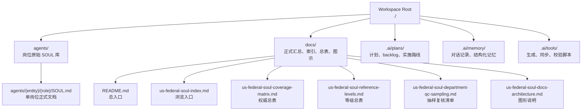
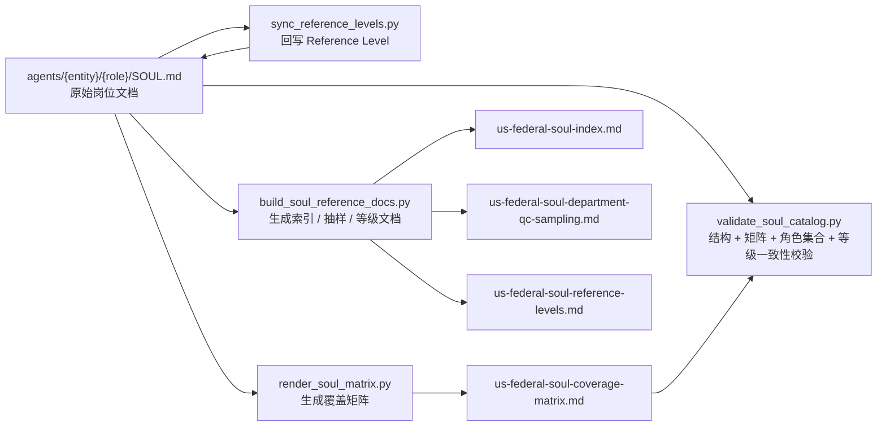
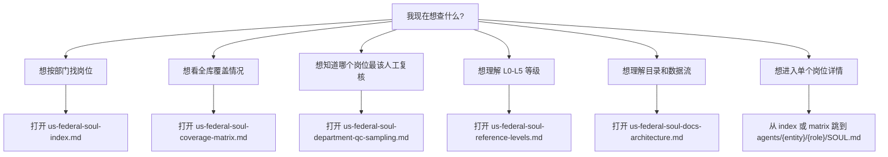
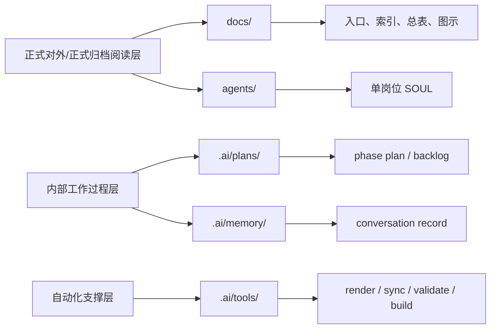

# US Federal SOUL Docs Architecture

> 这份文档用图把当前资料体系讲清楚。目标不是替代详细说明，而是让人“看一眼就知道目录怎么分、数据怎么流、遇到问题该打开哪份文档”。

## 1. 信息架构图

## 2. 数据生成关系图

## 3. 浏览路径图

## 4. 正式文档与内部文档的边界

## 5. 一句话理解当前结构

- `agents/` 是事实来源层
- `.ai/tools/` 是生成与校验层
- `docs/` 是正式阅读层
- `.ai/` 是内部过程记录层

## 6. 推荐操作顺序

1. 先看 [README.md](./README.md)
2. 再看 [us-federal-soul-docs-architecture.md](./us-federal-soul-docs-architecture.md)
3. 如果要查岗位，跳到 [us-federal-soul-index.md](./us-federal-soul-index.md)
4. 如果要做核对，跳到 [us-federal-soul-coverage-matrix.md](./us-federal-soul-coverage-matrix.md)
5. 如果要做人工抽样复核，跳到 [us-federal-soul-department-qc-sampling.md](./us-federal-soul-department-qc-sampling.md)
